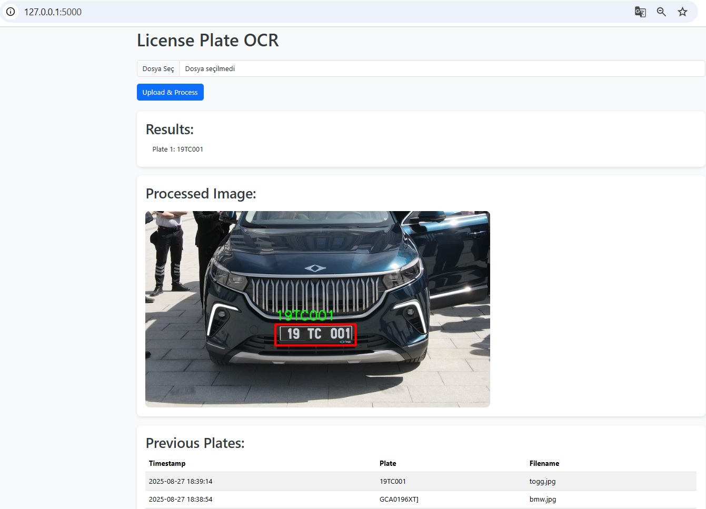
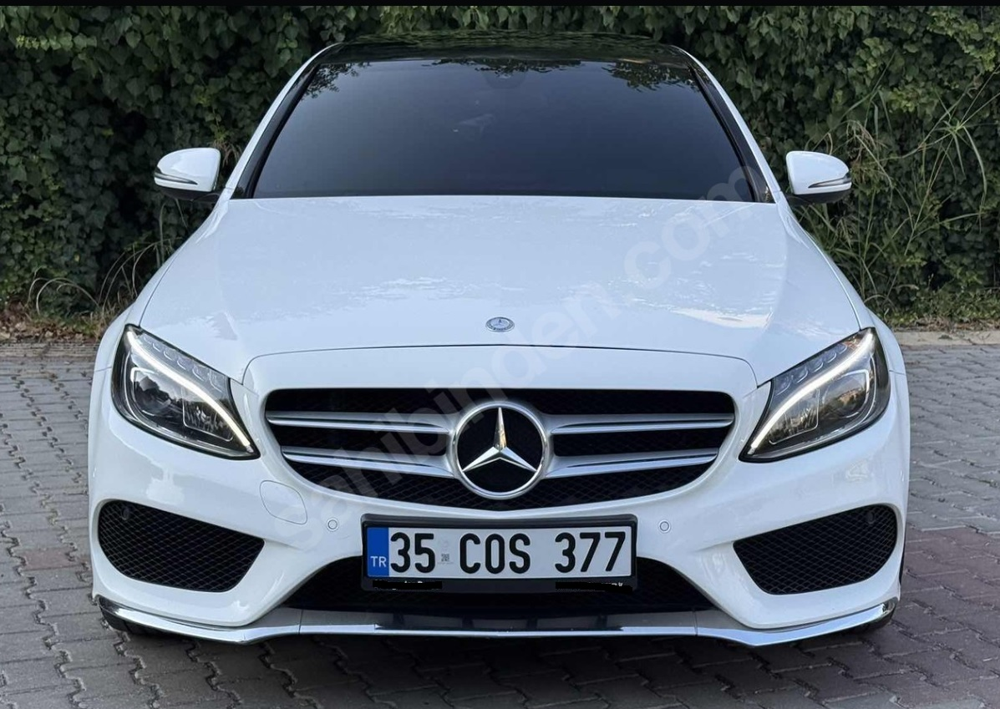
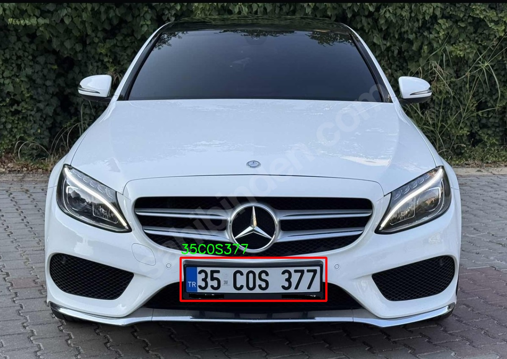

# OCR Number Plate Recognition



A simple **Python + Flask + EasyOCR** project for detecting and reading vehicle license plates from images. Results can be displayed on a web interface and stored in a database.

---

## 🚀 Features

- Detect vehicles and license plates in images  
- OCR for reading license plate numbers  
- Automatically corrects common OCR errors (e.g., O → 0, I → 1)  
- Displays processed images with bounding boxes  
- Saves recognized plates to **SQLite database**  
- Simple web interface for uploading images and viewing history  
- Delete entries directly from the web interface  

---

## 🖼️ Screenshots

### Upload Page


### OCR Result



> Not: Place these images in a `static/uploads/` folder in your repository.

---

## 🛠️ Tech Stack

- **Python 3.10+**  
- **Flask** – Web interface  
- **OpenCV** – Image processing and visualization  
- **EasyOCR** – Optical Character Recognition  
- **SQLite** – Database storage  
- **Bootstrap 5** – Frontend styling  

---

## 📂 Project Structure

license-plate-ocr/  
├── app.py  
├── db.py  
├── util.py  
├── static/  
│ └── uploads/  
├── templates/  
│ └── index.html  
├── models/  
│ └── license_plate_detector.pt  
├── static/  
│ └── uploads  
│   ├── index.jpg  
│   ├── mercedes.jpg
│   ├── result_mercedes.jpg  
├── requirements.txt  
└── README.md  


---

## ⚡ Installation

```bash
git clone https://github.com/<username>/polburak.git
cd polburak
python -m venv venv
# Windows
venv\Scripts\activate
# Linux / Mac
source venv/bin/activate
pip install -r requirements.txt
python app.py
```
Open your browser at http://127.0.0.1:5000

---
## 🖼️ Usage

1. Open the web interface in your browser.  
2. Upload an image of a vehicle.  
3. The system detects the vehicle and its license plate.  
4. OCR reads the plate and displays it on the image.  
5. Results are saved in the database and can be viewed in the history table.  
6. Optionally, delete unwanted entries directly from the table.
---

## 📝 Notes

1. OCR may occasionally misread characters.  
2. Currently optimized for **Turkey’s license plate format**, but can be extended.  
3. YOLO model weights (`license_plate_detector.pt`) must be in the `models/` folder.  
4. For best results, images should be clear and well-lit.  
